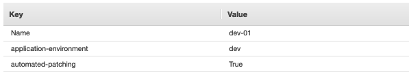
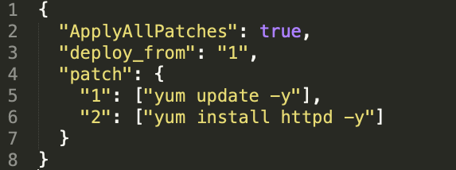
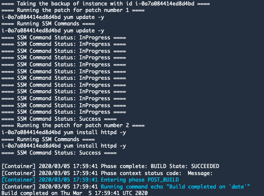

## Software Patch Using AWS Management Tools CI/CD and Terraform

The sample code here supports the Software Patch Management Using AWS serverless CI/CD and Terraform blog post. 
See the post for instructions and a detailed walkthrough.

### Prerequisites
-----------------------------

In order to run this template you will need an user with the permission to the following services:

- codepipeline
- codebuild
- s3
- ssm
- ec2
- sns

#### Terraform setup

For the templates used on this scenario, Terraform version 0.11.4 was used.

**Note:** *If you want to use version 0.12 please check this [guide](https://www.terraform.io/upgrade-guides/0-12.html) for the upgrade instructions.*

Here are the steps to install it on Linux. For other platforms, please check the official [installing terraform](https://learn.hashicorp.com/terraform/getting-started/install.html "installing terraform").

##### 1. Download and extract Terraform

    wget https://releases.hashicorp.com/terraform/0.11.14/terraform_0.11.14_linux_amd64.zip
    unzip terraform_0.11.14_linux_amd64.zip

##### 2. Move the executable to /usr/local/bin

`sudo mv terraform /usr/local/bin/`

##### 3. Validate the installation

    terraform --version
    Terraform v0.11.14

### Running the Sample Code
-----------------------------

Once terraform is configured it is time to download the templates and apply the code

#### Clone the repository

`git clone git@github.com:aws-samples/aws-cicd-patch-management-terraform.git`

#### Installing SSM Agent on EC2

SSM agent is needed in-order to run remote commands on instances. Hence all EC2 Instance must have SSM agent installed with the proper role configured. 
For more info about SSM required permissions check [here](https://docs.aws.amazon.com/systems-manager/latest/userguide/setup-instance-profile.html).
Please refer to this [link](https://docs.aws.amazon.com/systems-manager/latest/userguide/sysman-manual-agent-install.html) for the SSM installation guide.

Identify the instances you want to test the code and add the tags according to the instructions below.

For multiple instances you can use the [Tag Editor](https://docs.aws.amazon.com/ARG/latest/userguide/tag-editor.html) to tag several instances at once.

**Note:** *SSM Agent is installed, by default, on Amazon Linux _base_ AMIs dated 2017.09 and later. SSM Agent is also installed, by default, on Amazon Linux 2 AMIs.*

#### Tagging EC2 instances

This solution uses AWS SSM service to trigger remote commands to target EC2 instances. In order to filter out the environment, proper tags needs to be used.
Currently, instances are identified using environment name.

`Tag Key = application-environment`

`Value = EnvironmentName (dev, qa, stage or prod)`

`Tag Key = automated-patching`

`Value = True`

#### Editing the Patch file 

The json patch file determines the patches to be deployed on EC2 instances. This file is located under `/terraform/patch/templates/patch/patch.json`

 1.  **ApplyAllPatches:** Allowed options are `true of false`. If all patches needs to be applied then this option needs to be true otherwise it can be false
 
 2. **deploy_from:** If ApplyAllPatches option is set to false then user can specify the patch number they want to deploy patch from.
 
 3. **Patch**: This represents the all patches. User can add their patches in an increment order here.

#### Go to the terraform folder and initialize

That will download all terraform prerequisites modules

    cd terraform
    terraform init

You should see the following output

`Terraform has been successfully initialized!`

#### Run a plan

Terraform plan is a dry run that simulates the execution

`terraform plan`

After selecting the region it should output

`Plan: 26 to add, 0 to change, 0 to destroy.`

That means you are ready to apply the plan

#### Apply the plan

`terraform apply`

`Apply complete! Resources: 26 added, 0 changed, 0 destroyed`

#### Checking what was deployed

Go to the AWS Console and check the [CodePipeline](https://console.aws.amazon.com/codesuite/codepipeline "CodePipeline").
The default Pipeline name for this sample is *patch-pipeline*.

You will need to approve the changes so it can get propagated.

Verify CodeBuild execution logs to see the output of the execution.

That is also available on [Systems Manager Run Command History](https://console.aws.amazon.com/systems-manager/run-command/complete-commands)

### License
-----------------------------
This library is licensed under the MIT-0 License. See the LICENSE file.

